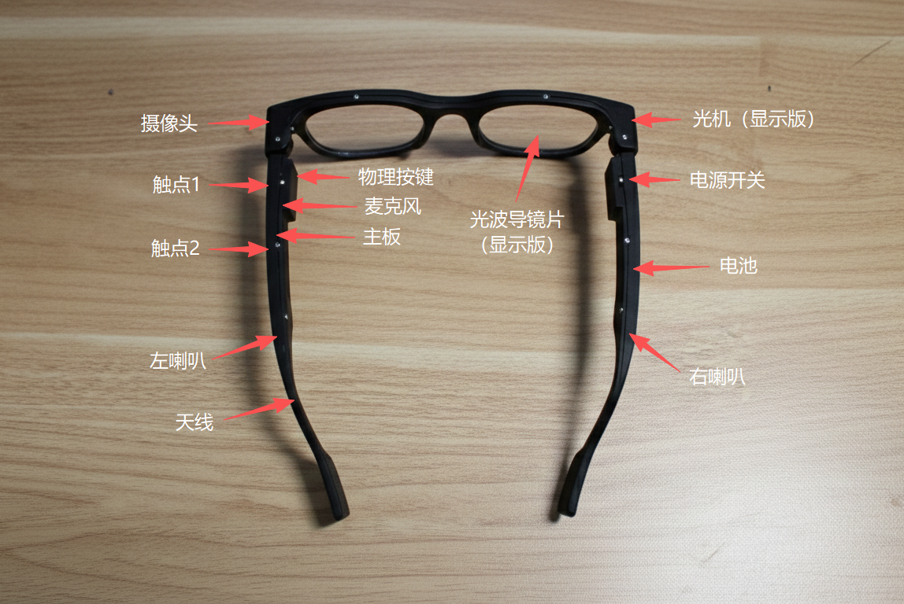

# 🥽 AI智能眼镜

> [!IMPORTANT]
> # 🚧 更多的资料正在补充中 🚧


**一个基于Linux的开源智能眼镜平台，适用于医疗、工业、教育和消费应用**

**中文** | [English](README.md)

[](https://github.com/ezxrdev/OpenSource-Ai-Glasses/actions)
[](LICENSE)
[](https://github.com/Iam5tilllearning/OpenSource-Ai-Glasses/releases)


---


## 📋 项目概述

这是一个基于Linux的开源智能眼镜工程，目前处于早期阶段，文档完善度45%。

本仓库主要开源的是系统软件与应用开发栈，开发并不依赖我们提供的整机套件。你可以基于任意 RV1106B 开发板开展系统与软件开发，再按自己的硬件方案适配外设。

**开发者交流群** | **联系作者**: iam5tilllearning@foxmail.com

| 微信交流群 | Discord社区 |
|:---:|:---:|
|  | <a href="https://discord.gg/7KqjKFZ7xA"></a> |
| 扫码加入微信群 | [加入Discord](https://discord.gg/7KqjKFZ7xA) |


## 🧩 硬件选择

你可以通过两种方式开展开发：

- 使用自己的 RV1106B 开发板，基于本项目开源的系统与软件栈继续开发。
- 如果希望更快进入 AI 眼镜整机联调，也可以选择我们已经做过深度封装的官方套件，减少硬件集成和外设适配工作量。

[**可选：购买官方 AI 眼镜套件**](https://item.taobao.com/item.htm?ft=t&id=1044923880613) — *适合快速上手，但不是开发前提*

[**备用购买链接**](https://item.taobao.com/item.htm?id=1007109700786) — *主购买页面不可用时可使用*

> [!CAUTION]
> **官方硬件兼容性提示**：v0.6.x 参考固件**仅适配 2026年1月1日之后生产的一体化硬件**。如果您的官方套件或同参考设计硬件是在此日期之前购买/生产的，请使用 v0.6.0 及更早版本的固件。

## ✅ 当前版本概要 (v0.6.5)

- 适配固件版本：v0.6.5。兼容 2026年1月1日之后生产的新硬件。
- 重点改进：整体稳定性提升，重点增强 AI Core 服务稳定性与可靠性。
- 质量优化：增强边界异常处理，并进行通用内部优化与清理。
- 发布形态：从该版本起提供两类固件，请按设备型号选择下载：
  - 音频版：`Firmware_RV1106B_RK962_IMX219.AudioVersion.img`
  - 显示版：`Firmware_RV1106B_RK962_IMX219.DisplayVersion.img`
- Release 详情：<https://github.com/Iam5tillLearning/OpenSource-Ai-Glasses/releases/tag/v0.6.5>

<details>
<summary>📜 版本历史概要</summary>

### v0.6.5（2026-03-16）
- 重点修复项目稳定性问题，特别是 AI Core 服务稳定性与可靠性。
- 增强异常与边界场景处理，进行内部优化与清理。
- 新增双固件发布形态：AudioVersion 与 DisplayVersion（按设备选择下载）。

### v0.6.4（2026-02-10）
- 显示能力版本功能升级，新增系统级 `display-service`。
- 与应用开发 SDK 集成，支持第三方应用图形渲染与显示。
- 新增实验性 `launcher-app`（图形启动与交互示例）。
- `display-service` 与 `launcher-app` 均开源，可用于学习、验证与二次开发。

### v0.6.3
- 适配固件版本：v0.6.3
- 新增蓝牙功能（蓝牙名称：OSAIG）
- 注意：小米手机存在兼容性问题
- 显示屏版本用户需自行处理显示问题

### v0.6.2
- 适配固件版本：v0.6.2
- SDK新增显示模块（UI/图片）及节能设置
- SDK新增ASR和LLM文本获取能力
- 优化30秒熄屏逻辑
- 升级GPIO Hub架构
- 优化3D模型结构
- 引入cJSON库，移除旧显示应用

### v0.6.1
- 适配固件版本：v0.6.1
- 兼容 2026年1月1日之后生产的新硬件

### v0.6.0
- 适配固件版本：v0.6.0
- 全新推出SDK

### v0.5.0
- 适配固件版本：v0.5.0
- 实现了完整的WiFi配网逻辑
- 详细的音频提示

### v0.4.0
- 基于核心server封装了一套SDK
- 开发者可以基于这套SDK实现拍照、GPIO、录音等功能

### v0.3.1
- 实现了系统哨兵

### v0.3.0
- 实现了核心server，负责拍照、GPIO、录音以及新版的AI对话

### v0.2.3
- 优化排线槽布局

### v0.2.2
- 修改眼镜前框模型，预留光机位置和波导片位置

### v0.2.1
- 修改镜腿模型，确定音腔和天线腔

### v0.2.0
- 第一版镜框3D打印成型

### v0.1.1
- 大量优化了AI对话的延迟，首包端到端延迟1s左右

### v0.1.0
- 实现了基础的AI对话

</details>

## 🔍 硬件布局



> [!WARNING]
> **摄像头方向提示**：在当前眼镜硬件结构设计中，摄像头的安装方式会导致采集到的图像天然旋转 90 度。如果您使用的是当前眼镜参考硬件设计，请在云端程序中自行增加图像方向预处理，再进行后续视觉处理。

## ✨ 核心特性

- 🖥️ **显示**: 30°FOV 640×480单色单目显示（选配）
- 📸 **摄像头**: 1080P录像
- 🔊 **音频**: 麦克风 + 扬声器
- 📡 **连接**: WiFi 802.11b/g/n、蓝牙5.3、USB 2.0
- ⚡ **性能**: 单Cortex-A7核，8GB存储
- 🔋 **续航**: 180mAh电池，听歌2小时，显示3小时，录像45分钟
- ⚖️ **重量**: 仅43g
- 🧠 **传感器**: 仅支持选配 IMU
- 🐧 **系统**: 嵌入式Linux系统

## 🚀 快速开始

> **💡 提示**: 如果您购买的是上方链接中的[官方 AI 眼镜套件](https://item.taobao.com/item.htm?ft=t&id=1044923880613)，设备已预装固件，可直接使用；如果您使用自己的 RV1106B 开发板，请从下方主机开发环境和固件烧录流程开始。

### 使用主机开发环境（推荐）

推荐直接在 Ubuntu/Debian 主机，或 Windows 的 WSL2 Ubuntu/Debian 环境中完成固件开发和应用开发。

> **开发环境唯一获取方式**: `https://github.com/makevary/AIGLASS_DEV_ENV`

```bash
# 获取开发环境
git clone https://github.com/makevary/AIGLASS_DEV_ENV.git
cd AIGLASS_DEV_ENV

# 修复/安装编译依赖（支持 Debian/Ubuntu 与 WSL2 的 Ubuntu/Debian）
./setup_build_env.sh

# 编译固件（以下两条命令二选一）
./build.sh
./build.sh --without-display

# 固件输出
ls -lh output/image/update.img
```

编译参数选择：
- 设备带显示能力：`./build.sh`
- 设备不带显示能力：`./build.sh --without-display`

> **说明**: `setup_build_env.sh` 使用 `apt-get` 安装依赖，仅支持 Debian/Ubuntu 系统（含 WSL2 中的 Ubuntu/Debian）。

详细说明请查看 [开发环境搭建指南](docs/ENV_SETUP.md)

**固件烧录**: 固件编译完成后，请参考 [固件烧录指南](docs/FIRMWARE_FLASHING.md) 将固件烧录到设备。

**应用开发**: 主机环境提供完整开发链路，可用于开发用户级应用程序。详细说明请查看 [应用开发指南](docs/APPLICATION_DEVELOPMENT.md)。


## 📖 使用指南

### 1. 配网模式
- **自动进入**：设备开机未连接网络时会自动进入配网模式。
- **手动进入**：任何时刻连续短按按键10次，可主动进入配网模式。
- **当前配网方式**：使用 Android 手机分享 Wi-Fi 二维码，眼镜扫描二维码后完成联网。
- **频段限制**：仅支持 2.4GHz Wi-Fi，不支持 5GHz/5G Wi-Fi。
- **App 状态**：手机端 App 即将上线，后续会提供更便捷的配网入口。

### 2. AI对话
- **操作方式**：配网完成后，长按左侧镜腿按键开始说话，松开结束，等待AI回复。

> [!WARNING]
> **附送 AI 服务说明**
> - **附送且可选**：`ai-core` 和 `guard` 为固件预装的便捷组件，用于开箱即用体验，属于可选能力，**不影响**开发者进行开源二次开发。
> - **可完全自主开发**：开发者可以仅基于公开 SDK（相机/GPIO/音频/IPC）独立开发，无需依赖 `ai-core` 或 `guard`。
> - **开发便捷性**：`ai-core` 作为系统服务统一管理摄像头/麦克风/扬声器/屏幕/GPIO 等硬件；如果你的需求与内置流程匹配，基于 `ai-core` 开发通常会比直接基于 Rockchip SDK 从零实现更简单、更友好、更快。
> - **立场说明**：这并不是为了强推 `ai-core`。我们只是把已用于商用场景的服务以附送方式放在开源项目里，方便开发者快速上手；你也可以完全不使用它。
> - **隐私提示**：若启用 `ai-core`，AI 对话过程中可能会调用摄像头拍照并上传云端用于实时识别。图像仅作即时处理，**不会持久化保存**。
> - **关闭附送服务（Rockchip SDK 模式）**：移除或重命名 `/etc/init.d/S53_guard` 启动脚本后，断电重启设备；开机后使用 `top` 命令确认 `ai-core` 和 `guard` 进程不再运行。


## 📦 SDK开发

本项目提供了一套完整的C/C++ SDK，开发者可以基于此SDK轻松调用底层的硬件能力，开发自己的应用程序。

**SDK核心功能：**
*   **GPIO事件订阅**：低延迟获取按键等GPIO事件
*   **摄像头调用**：通过共享内存零拷贝获取图像数据
*   **音频播放控制**：控制音频播放，支持TTS
*   **进程间通信**：基于Unix Domain Socket的可靠通信

**SDK位置**：[`SDK/ai_glass_sdk`](SDK/ai_glass_sdk)

**资源导航：**
*   📖 [SDK说明文档](SDK/ai_glass_sdk/README.md) - SDK的详细说明和使用方法
*   📚 [API参考文档](SDK/ai_glass_sdk/docs/README.md) - 详细的API说明
*   💡 [示例程序](SDK/ai_glass_sdk/examples) - 包含GPIO、摄像头、音频等功能的完整示例代码

**集成指南：**
请参考 [SDK README](SDK/ai_glass_sdk/README.md#3-集成到自己的项目) 中的"集成到自己的项目"章节，了解如何在您的应用中链接和使用SDK。


## 🏗️ 系统架构


## 📚 文档

- [🧰 开发环境搭建指南](docs/ENV_SETUP.md) | [English](docs/ENV_SETUP.en.md)
- [💻 应用开发指南](docs/APPLICATION_DEVELOPMENT.md) | [English](docs/APPLICATION_DEVELOPMENT.en.md)
- [⚡ 固件烧录指南](docs/FIRMWARE_FLASHING.md) | [English](docs/FIRMWARE_FLASHING.en.md)

## 🛠️ 开发

### 从源码构建

```bash
# 获取完整开发环境
git clone https://github.com/makevary/AIGLASS_DEV_ENV.git
cd AIGLASS_DEV_ENV

# 安装/修复编译依赖
./setup_build_env.sh

# 编译固件
./build.sh

# 固件产物
ls -lh output/image/update.img
```

### 开发工具

- **IDE**: VS Code with C/C++ extension

### API概述

```c
待完善
```

## 🎯 应用场景

### 🏥 医疗应用

<details>
<summary>医疗AI智能眼镜场景</summary>

#### 智能识别患者身份与信息
医生或护士一进入病房，眼镜通过人脸识别或腕带扫描，瞬间在视野角落显示患者姓名、床号、主要诊断、过敏史和关键生命体征，无需反复查阅病历夹或电脑。

#### 实时生命体征监测与预警
眼镜能实时读取并整合床旁监护仪、输液泵等设备数据。一旦患者心率、血氧、血压等指标出现异常波动，系统会立即在视野中高亮警示，并通过骨传导耳机发出轻柔但明确的预警声。

#### 辅助操作与规程核对
在执行输液、给药等操作时，眼镜的摄像头会自动扫描药品条码与患者腕带，核对"三查七对"信息。若发现药物剂量错误、患者不匹配或存在过敏风险，会立即以醒目方式弹出警告，杜绝医疗差错。

#### 无接触调阅与记录信息
医生进行查房或操作时，可通过语音指令或手势，在空中虚拟调阅患者的电子病历、影像报告（如CT/MRI），并将口述的查房记录实时转为文字存入系统，实现"所见即所记"，极大解放双手。

#### 远程专家协作与指导
在复杂会诊或紧急抢救时，低年资医生可第一视角共享实时画面给远端专家。专家可在共享画面上进行标注、圈出重点，并通过语音通讯进行指导，如同专家亲临现场，提升基层医疗水平。

</details>

### 🏭 工业应用

<details>
<summary>变电站应用场景</summary>

#### 看懂操作票
甭管是纸质的还是电子的操作票，眼镜一扫，它能自己把上面的关键信息（比如要操作哪个设备、是合上还是断开）给提取出来，不用我再去一个字一个字地手动输入核对。

#### 认识现场设备
戴着眼镜在变电站里走，它就像个老巡检员一样，能通过摄像头和AI实时认出眼前的是断路器、隔离开关还是接地刀闸。

#### 有安全规矩
系统内置了所有的电力安全规程和"五防"逻辑。能把我刚才识别的操作指令和现在眼前看到的真实设备状态进行比对，判断我下一步操作会不会出事。

#### 及时开口提醒
一旦它发现我可能要走错间隔、或者要操作错误的设备，马上就会用声音警告，比如"错误！这是102开关，请核对！"，阻止犯错。整个过程必须是实时的，不能有延迟。

#### 在现场独立干活
所有的计算和判断都支持本地部署，确保在网络不稳定的急诊或ICU区域功能不受影响。

</details>

<details>
<summary>维修场景</summary>

#### 实时视频通话与画面共享
现场维修人员通过眼镜摄像头，将故障设备的第一视角实时视频共享给后方的专家团队。专家无需亲临现场，即可如亲眼所见，精准把握现场状况。维修时解放双手。

#### AR标注与实时指导
专家可以在共享的视频画面上进行AR标注（如画圈、箭头指示、文字注释），直接"投射"到现场人员的视野中，精确指导其"拧这个螺丝"、"测量那个点的电压"，极大提升沟通效率。

#### 多方会诊与知识沉淀
支持多位专家同时接入一个视频会话，进行"多方会诊"，快速解决复杂难题。整个指导过程可录制存档，形成针对特定故障的维修案例库，用于后续培训。

#### 文件与图纸即时调阅
现场人员可通过语音指令，请求专家远程推送图纸、手册或3D模型等文件。专家可将资料直接发送并显示在维修人员的眼镜视野一侧，边看边操作。

</details>

### 🎓 教育应用

<details>
<summary>AR智能作业指导与流程确认</summary>

#### 可视化操作清单
将复杂的SOP（标准作业程序）分解为一步步的AR指令，直接叠加显示在操作员视野中的真实设备上。当前需要执行的操作步骤会高亮提示，完成一步，自动进入下一步。

#### 工具与物料识别
眼镜能识别操作员拿起的是否为当前步骤指定的工具或物料。若拿错，会立即发出警示，防止因使用错误工具导致的设备损坏或装配问题。

#### 自动步骤确认与记录
系统通过视觉识别自动判断某个步骤是否已完成（如"螺丝已拧紧"、"线缆已插接到位"），并自动记录完成时间和操作员信息，实现无纸化且防错的流程确认。

#### 手忙时语音导航
在操作员双手被占用时，可通过语音指令"下一步"、"上一步"、"重复"来控制指导流程的播放，完全解放双手，聚焦于操作本身。

#### 新人培训与技能传承
新员工可依靠AR指导快速上岗，减少培训成本和出错率。老师傅的最佳实践和操作技巧也能通过AR流程固化下来，实现高效的知识传承和标准化作业。

</details>

## 🤝 贡献

我们欢迎各种形式的贡献！

### 如何贡献

> [!IMPORTANT]
> **开发环境唯一获取方式**：请从 `https://github.com/makevary/AIGLASS_DEV_ENV` 获取开发环境。
>
> **克隆目录要求**：如果您需要编译 `src` 或 `samples` 目录下的代码，请在 `AIGLASS_DEV_ENV` 开发环境根目录中克隆本项目，以满足编译系统相对路径依赖。
>
> 正确的目录结构示例：
> ```
> /path/to/AIGLASS_DEV_ENV/
> ├── OpenSource-Ai-Glasses/    # 本项目
> ├── luckfox-pico/             # 系统SDK
> └── ...
> ```

1. 🍴 Fork 本仓库
2. 📥 克隆您的 Fork 到本地（在 `AIGLASS_DEV_ENV` 根目录中执行），并初始化 submodule
   ```bash
   cd /path/to/AIGLASS_DEV_ENV  # 进入开发环境根目录
   git clone https://github.com/YOUR_USERNAME/OpenSource-Ai-Glasses.git
   cd OpenSource-Ai-Glasses
   git submodule update --init --recursive
   ```
3. 🌿 创建功能分支 (`git checkout -b feature/AmazingFeature`)
4. 💻 提交您的更改 (`git commit -m 'Add some AmazingFeature'`)
5. 📤 推送到分支 (`git push origin feature/AmazingFeature`)
6. 🔃 创建 Pull Request

### 开发领域

- 🐛 **Bug修复**: 报告和修复问题
- ✨ **新功能**: 提出并实现新功能
- 📚 **文档**: 改进指南和API文档
- 🧪 **测试**: 添加测试并提高覆盖率
- 🌐 **国际化**: 添加语言支持

## 📄 许可证

本项目采用 Apache License 2.0 许可证 - 查看 [LICENSE](LICENSE) 文件了解详情。

## 🙏 致谢

- [Linux Foundation](https://www.linuxfoundation.org/) 提供Linux操作系统支持
- [OpenCV](https://opencv.org/) 提供计算机视觉能力
- [BlueZ](https://www.bluez.org/) 提供蓝牙协议栈
- 社区贡献者和测试者

## 📞 联系我们

- **项目维护者**: [Iam5tilllearning](mailto:iam5tilllearning@foxmail.com)
- **问题反馈**: [GitHub Issues](https://github.com/Iam5tilllearning/OpenSource-Ai-Glasses/issues)
- **讨论**: [GitHub Discussions](https://github.com/Iam5tilllearning/OpenSource-Ai-Glasses/discussions)

## 🌟 Star历史

[](https://star-history.com/#Iam5tilllearning/OpenSource-Ai-Glasses&Date)

---

<div align="center">

**⭐ 如果这个项目对您有帮助，请给我们一个Star！**

由开源社区用❤️制作

</div>

---

**最后更新**: 2026-03-30 | **版本**: v0.6.5
