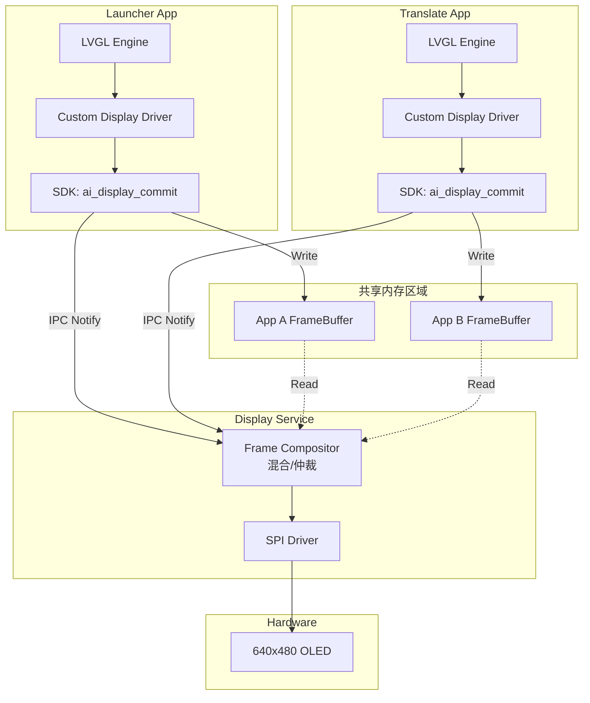

# Display 服务架构设计方案

## 背景与目标

当前 AI 眼镜系统已有一个 `ai-core` 服务负责 GPIO、WiFi、AI 对话和相机控制，并通过 SDK 对外暴露接口。现需要将 `display` 模块重构为**独立的显示服务**，但**LVGL UI 渲染引擎将下沉到客户端应用中**，以赋予应用最大的 UI 定制自由度。

### 设计目标

1. **客户端渲染**: 每个应用（如 Launcher、翻译 App）拥有独立的 LVGL 上下文，负责绘制自己的 UI。
2. **服务端合成**: `display-service` 作为守护进程，管理 SPI 硬件，负责接收客户端的帧数据并推送到屏幕。
3. **零拷贝传输**: 客户端直接将 UI 渲染到共享内存（Shared Memory）中，避免数据拷贝。
4. **多应用切换**: 服务端负责仲裁当前显示哪个应用的画面。

---

## 核心设计决策

### 1. 架构模式：客户端渲染 (Client-Side Rendering)

- **Client (App)**: 
    - 静态链接 `liblvgl`。
    - 运行独立的 LVGL 主循环。
    - 自定义 `disp_drv`，将 `flush_cb` 指向共享内存。
- **Service (Server)**: 
    - **不运行** LVGL 绘图逻辑。
    - 仅作为 "Display Server/Compositor"。
    - 监听共享内存状态，将 Ready 的帧通过 SPI 发送给屏幕。

### 2. 显示协议

- 采用 **Frame Buffer 交换协议**。
- 客户端在共享内存中申请 Frame Buffer。
- 渲染完成后，发送 `COMMIT` 指令给服务端。

---

## 系统架构



---

## SDK 设计 (ai_display.h)

客户端 SDK 不再提供 `show_text` 这种高层接口，而是提供底层的帧缓冲管理接口，供 LVGL 的移植层调用。

```c
// ================== 初始化 ==================
ai_display_client_t* ai_display_init(void);
int ai_display_connect(ai_display_client_t *client);

// ================== 帧缓冲管理 ==================

/**
 * 获取共享显存指针
 * @return 指向 640x480x4bit (153.6KB) 缓冲区的指针
 * 应用直接在这个内存上进行 LVGL 渲染
 */
uint8_t* ai_display_get_framebuffer(ai_display_client_t *client);

/**
 * 提交帧
 * @param area  更新区域 (x, y, w, h)，支持局部刷新优化
 * 告诉服务端：我画好了，请把数据发给屏幕
 */
int ai_display_commit_frame(ai_display_client_t *client, 
                            int x, int y, int w, int h);


// ================== 应用控制 ==================
/**
 * 申请前台显示权
 * 当应用想显示时调用，服务端会决定是否允许（根据优先级）
 */
int ai_display_request_focus(ai_display_client_t *client);
```

---

## LVGL 客户端集成指南

在客户端代码中（如 `samples/launcher-app/main.c`），开发者需要这样配置 LVGL：

```c
// 1. 获取共享内存
uint8_t* shm_buf = ai_display_get_framebuffer(client);

// 2. 注册 LVGL 显示驱动
void my_flush_cb(lv_disp_drv_t * disp_drv, const lv_area_t * area, lv_color_t * color_p) {
    // 因为我们是直接渲染到共享内存 shm_buf 的，所以这里不需要 memcpy
    // 只需要通知服务端刷新即可
    
    ai_display_commit_frame(client, 
        area->x1, area->y1, 
        area->x2 - area->x1 + 1, 
        area->y2 - area->y1 + 1
    );
    
    lv_disp_flush_ready(disp_drv);
}

// 3. 初始化缓冲区
lv_disp_draw_buf_init(&draw_buf, shm_buf, NULL, 640 * 480);
```

---

## IPC 数据结构

```c
#define AI_DISPLAY_SHM_SIZE  (512 * 1024) // 512KB

typedef struct {
    // 状态头
    volatile int active_client_pid;  // 当前正在显示哪个进程
    
    // 帧缓冲 (640 * 480 / 2 = 153,600 bytes)
    // 预留两个槽位，支持两个应用同时运行（例如主应用+通知）
    uint8_t framebuffer_slot_0[153600]; 
    uint8_t framebuffer_slot_1[153600];
    
} ai_display_shm_t;
```

---

## 目录结构规划

```diff
  OpenSource-Ai-Glasses/
  ├── SDK/
  │   └── ai_glass_sdk/
  │       ├── include/
+ │       │   └── ai_display.h     # 帧缓冲管理 API
+ │       └── third_party/
+ │           └── lvgl/            # LVGL 源码库（供客户端静态链接）
  ├── src/
+ │   ├── display-service/         # 纯守护进程（负责 SPI 传输）
  │   └── ffm_launcher/
+ └── samples/
+     ├── launcher-app/            # 完整的 LVGL 应用
+     │   ├── ui/                  # SquareLine 生成的 UI 代码
+     │   └── main.c               # 集成 ai_display SDK + LVGL
```

---

## 优势

1. **极致灵活**: 客户端可以使用 LVGL 的任何功能（动画、复杂控件、自定义样式）。
2. **逻辑解耦**: App 崩溃不会导致 Display Service 崩溃，Display Service 只负责搬运像素。
3. **符合主流**: 类似 Wayland/SurfaceFlinger 的架构，服务端只管合成/显示，客户端管渲染。
